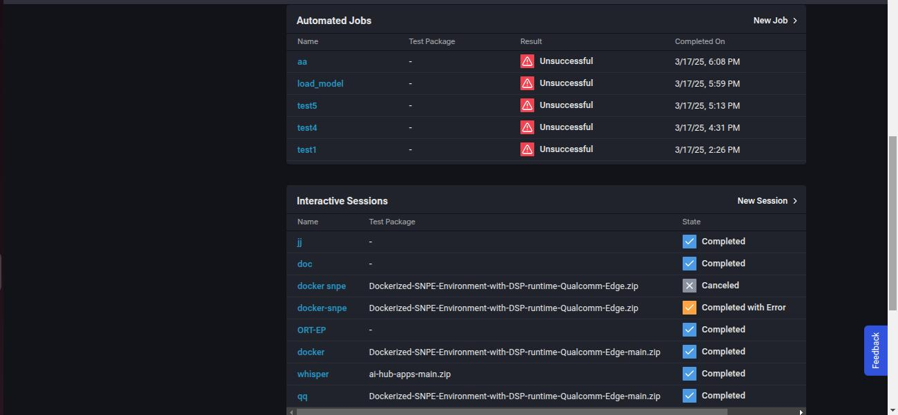
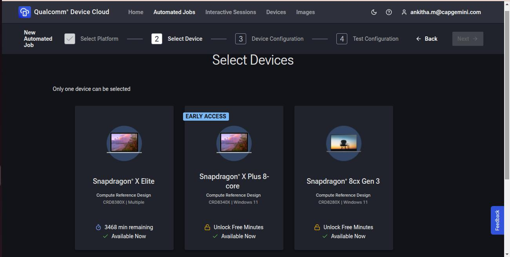

# Provisioning Snapdragon X Elite on Qualcomm Device Cloud
 
This project utilizes Qualcomm’s advanced device cloud infrastructure to enable remote testing and provisioning of applications across mobile, compute, and IoT devices. This platform allows developers and testers to conduct live testing and automated evaluations on Qualcomm-powered smartphones, tablets, laptops, and IoT devices. 

The project uses advanced hardware to make sure applications run smoothly, use less power, and provide a better user experience, making the testing process easier and improving the overall development workflow.

Additionally, each device can be accessed for free for up to 5000 minutes, allowing developers to test their applications without any cost concerns.

## Prerequisites

   - Ubuntu or Windows.

## Instructions

#### 1. Visit https://qdc.qualcomm.com/ and sign up for an account to create a new session. 

#### 2. The Home screen provides a dashboard for all Qualcomm Device Cloud functions. 

The following panels are available: 
1. Welcome – Provides links to create a new Automated Job or Interactive Session. 

2. FAQ – Provides help documentation for frequently asked questions. 

3. Recommended devices – Displays a selection of Qualcomm Devices, including device details, minutes available, device availability status, and links to create a new Automated Job or Interactive Session. 

4. Automated Jobs – Displays a history of Automated Jobs the user has run.  

5. Interactive Sessions – Displays a history of Interactive Sessions the user has run. 

### In the home page we have two options to proceed

## Automated Jobs: 
Automated Jobs are predefined test cases that are run on the device without user interaction. They can be predefined test cases that result in pass/fail, or tests that provide random interaction with the device.  

1. Create New Job - Click + New Job 

2. Select Mobile or Compute and click Next. 

3. Under Mobile/Compute Section, Select one device (Snapdragon® X Elite) on which to run tests and fill the mandatory fields to Unlock your free 5000 minutes. Click Next. 

4. Device Configuration: 

   - For Mobile- toggle any additional device configurations: 
     - Wi-Fi Enabled 
     - Screen Always On 
     - Bluetooth Enabled

   - For Compute- toggle any additional device configurations: 
     - Select Available Flash Configuration 
     - Install SNPE 

5. Click on NEXT

6. Enter the Job Details : 

   - Enter a Job Name. 

   - Enter the Maximum Minutes Per Device: After this amount of time, the test will time out. 

7. Provide the Package Upload: 
   - For Mobile: 

     - Select Application or AI Model (note that AI models must be SNPE-compliant). Click Upload and select an .apk (for applications) or .zip (for AI models). 

     - Alternatively, click Saved to select from previosly uploaded applications/AI models. 

   - For Compute: 

     - Select Application or AI Model. Click Upload and select .msi or .zip (for applications) or .zip (for AI models). 

     - Alternatively, click Saved to select from previosly uploaded applications/AI models.  

8. Provide The Test Details:  

   - For Mobile: Select a test type – Appium or Monkey Test.
     - For Appium: (Prepare Appium Test Packages), click Upload and select a .zip file containing the Appium test package. 

     - For Monkey Test: Enter the event count. This is the number of random clicks, touches, or gestures generated to stress test the application. 

   - For Compute: click Upload and select a .zip file containing the Appium test package. 

   - In this example Appium has been selected under compute.

9.  Click Submit Job     

   - After a job is submitted, you will be taken to the Automated Jobs page. Here, you can see the Automated Jobs you have created along with the status of each job    

   - The list of jobs includes Job Name, Result, Device, Completion Timestamp, Test Framework used, and Test Package used 

   -Based on the test status, the Result can be pending, successful, Unsuccessful, Canceled, or Error. 

   - Click the Job Name to open the Job Results window. 

## Interactive Sessions: 

Interactive Sessions allow you to test your application live and interact with a device in real-time. 

1. New Interactive Session - Click + New Session 

2. In Select a Platform section, select Mobile/Compute option and click Next. In this example Compute has been selected. 

3. In Select Device section, select one device (Snapdragon® X Elite) and fill the mandatory fields to Unlock your free 5000 minutes and click on Next. 

4.  In Device Configuration check the toggle button to install SNPE and configure another Qualcomm build and click on Next. 

5. In Test Configuration fill in the mandatory fields in Session details like Session name according to your use case choose the mode of operation out of three modes and follow the appropriate guide provided for each mode. For this use case I have selected screen mirror only. Optionally There is a provision of Package Provider to upload your applications and models in the zip format. 

6. Once you are done, it will enable Create Session tab click on it and continue

7. The process will take some time and will open the window, and you are ready to access cloud device. 

